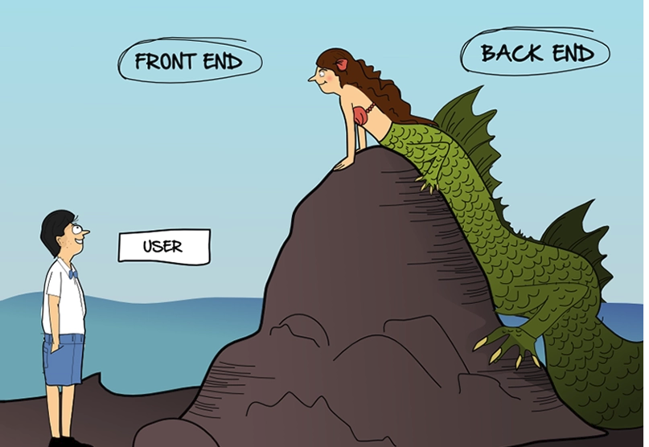
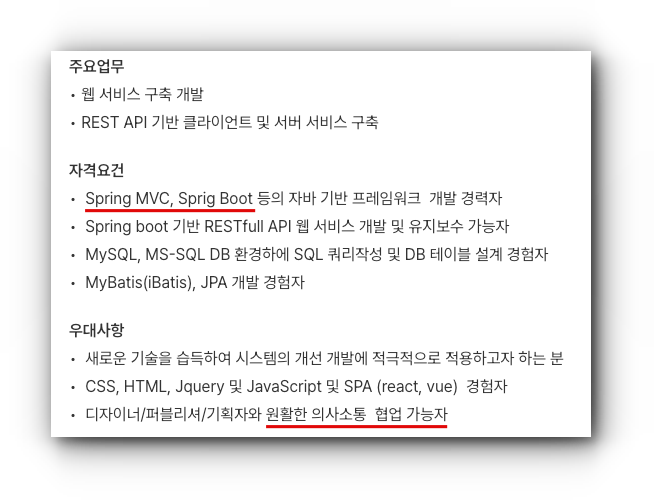
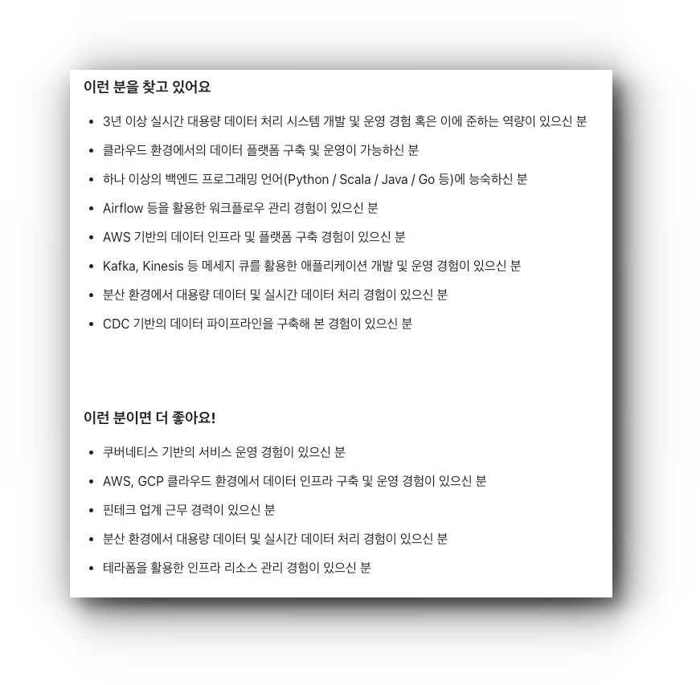
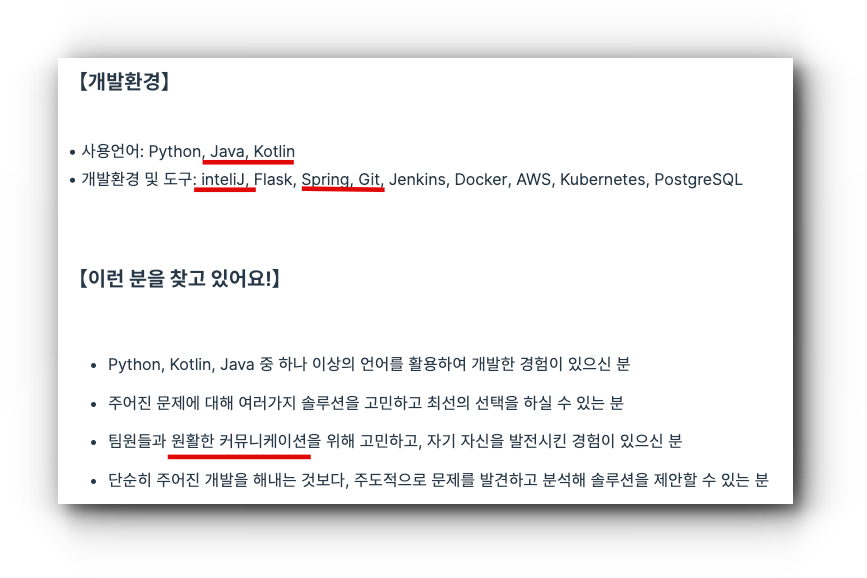
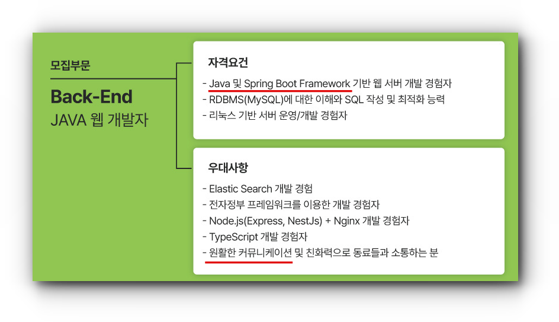

# 자바 백엔드 개발자 로드맵

# 백엔드란

**백엔드**

우리가 자주 사용하는 다양한 애플리케이션에서 눈에 보이지 않는 다양한 기능을 처리하는 영역

**프론트엔드**

시각적으로 보면서 사람이 조작할 수 있는 다양한 인터페이스를 처리하는 영역

  
출처: comic.browserling.com

**퍼블리싱**

디자이너에게 전달받은 초안을 가지고 HTML, CSS를 사용하여 웹페이지를 제작

**백엔드 개발자**

- [ ]  시스템을 설계, 구현, 개발, 운영 및 유지보수를 하는 사람
- [ ]  html, css, javascript 정도는 백엔드 개발자라고 하더라도 다룰 줄 알아야 함(개발 및 유지보수 가능 수준)

# 자바 백엔드 개발자 자격 요건

## 최소 SI 혹은 스타트업

**신입기준**

- [ ]  Java
- [ ]  Git, GitHub(GitLab, Bitbucket)
- [ ]  JSP, Servlet
- [ ]  Spring Framework
- [ ]  SQL, RDBMS(MariaDB, MySQL, MsSQL, PostgreSQL, Oracle…)
- [ ]  MyBatis
- [ ]  HTML, CSS, Javascript, jQuery

**중고신입 혹은 경력 기준**

- [ ]  EgovFramework(전자정부프레임워크), SpringSecurity
- [ ]  Tomcat, NginX, Windows, Linux,
- [ ]  Maven

## 서비스 및 자체 플랫폼 회사(중견급)

- [ ]  Kotlin
- [ ]  SpringBoot
- [ ]  JPA(Spring Data JPA, QueryDSL)
- [ ]  Spring Batch
- [ ]  NoSQL DB(Redis, MongoDB)
- [ ]  Gradle
- [ ]  Docker
- [ ]  Kubernetes
- [ ]  Jenkins
- [ ]  Kafka
- [ ]  CI/CD

## 네카라쿠배당토 급 회사

- [ ]  알고리즘, 자료구조(코딩테스트)
- [ ]  디자인패턴, 아키텍쳐
- [ ]  비동기
- [ ]  Spring Cloud
- [ ]  OAuth2, JWT
- [ ]  TDD, DDD
- [ ]  MSA
- [ ]  등등등….거의 전부

## 자주 사용하는 툴

- [ ]  IntelliJ, Eclipse
- [ ]  VS Code
- [ ]  협업 메신저(Slack, MS Teams, 회사 자체 메신저), JIRA,
- [ ]  Excel
- [ ]  PPT
- [ ]  MarkDown

## 자바 백엔드 개발자 주요 구직 내용

**서울 / E사 ([링크](https://www.wanted.co.kr/wd/166181))**

**서울 / D사 ([링크](https://about.daangn.com/jobs/5107831003/))**

**서울 / P사 ([링크](https://career.programmers.co.kr/job_positions/9647))**

**부산 / M사 ([링크](https://www.saramin.co.kr/zf_user/jobs/relay/view?isMypage=no&rec_idx=47325065&recommend_ids=eJxNkMsZwzAMgqfpXQ9kpHMHyf5b1E4ay8f%2FQ4AxaBHJvFLHh18M1yqJq8QW0kUg41VpTCgm6qM6qUuVB7WA2l5LiHMfm2FG7yiXSNej6MUL%2F%2BwxAt2s4ea7aiHYqgzJ6GyEydFMRmh7q%2BbOY1M5e4RFBby9WfNhfVxecn%2FAD9WzRBY%3D&view_type=search&searchword=%EC%9E%90%EB%B0%94+%EB%B0%B1%EC%97%94%EB%93%9C&searchType=search&gz=1&t_ref_content=generic&t_ref=search&paid_fl=n&search_uuid=71184b7d-1e95-47b7-bd2c-4b9f581e9261&immediately_apply_layer_open=n#seq=0))**

# 공부 방법

## 학습 방법

**국비, 부트캠프**

- 장점: 짜여진 커리큘럼, 팀 프로젝트, 강제성
- 단점: 실력과 무관한 진도, 최신 트렌드 학습 어려움, 실무와의 괴리

**독학**

- 장점: 본인의 스케줄에 맞는 학습 가능
- 단점: 의지박약, 학습의 시간 비용이 많이듦

**인터넷강의**

- 장점: 원하는 시간대 학습 가능, 강사의 이력을 확인 가능, 최신 트렌드를 배울 수 있음, 실무에서 사용하는 방법을 배울 수 있음
- 단점: 많은 비용, 의지박약

**도서**

- 장점: 신뢰할 수 있는 정보 학습, 원하는 기술을 학습 가능
- 단점: 시간과 비용, 학습 시간, 의지박약

## 인터넷 강의 추천

**무료강의**

- [ ]  [생활코딩](https://opentutorials.org/course/1) - 입문 최고의 강의
- [ ]  유튜브 - [자바의 정석 기초편](https://www.youtube.com/playlist?list=PLW2UjW795-f6xWA2_MUhEVgPauhGl3xIp) - 자바의 정석 교재 저자의 직강
- [ ]  유튜브 - [얄팍한 코딩사전](https://www.youtube.com/@yalco-coding) - 기초 지식을 가볍게 듣기 좋음

**유료강의**

- [ ]  인프런 - [우아한형제들 최연소 기술이사 출신 김영한의 스프링 완전 정복](https://www.inflearn.com/roadmaps/373)
- [ ]  인프런 - [RDBMS Modeling 기초](https://www.inflearn.com/course/%EA%B4%80%EA%B3%84%ED%98%95%EB%8D%B0%EC%9D%B4%ED%84%B0%EB%B2%A0%EC%9D%B4%EC%8A%A4-rdbms/dashboard)
- [ ]  [노마드코더](https://nomadcoders.co/)

## 책 추천

- [ ]  [스프링 부트와 AWS로 혼자 구현하는 웹 서비스 인텔리제이, JPA, JUnit 테스트, 그레이들, 소셜 로그인, AWS 인프라로 무중단 배포까지](https://www.yes24.com/Product/Goods/83849117)
- [ ]  [자바의 신](https://www.yes24.com/Product/Goods/42643850)
- [ ]  [코드로 배우는 스프링 웹 프로젝트 현업 개발을 위한 단계별 실습서 [ 개정판 ]](https://www.yes24.com/Product/Goods/64340061)

# 마무리…

**보면 좋은 사이트**

[Backend Developer Roadmap: What is Backend Development?](https://roadmap.sh/backend)

[백엔드 개발자 로드맵 및 공부 순서ㅣ기술 면접 질문, 포트폴리오 예시 - 코드스테이츠 공식 블로그](https://www.codestates.com/blog/content/백엔드-개발자-로드맵)

[누구도 알려주지 않는 백엔드 로드맵 | 요즘IT](https://yozm.wishket.com/magazine/detail/2064/)